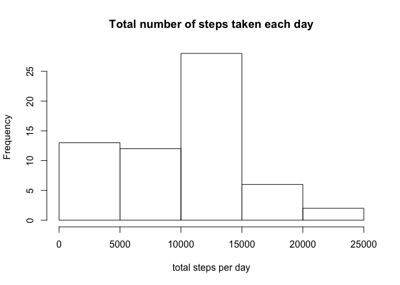
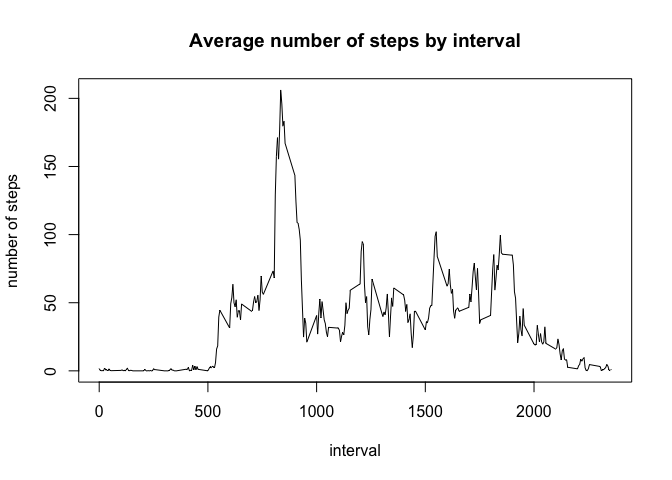
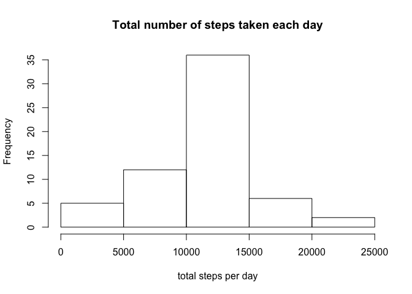
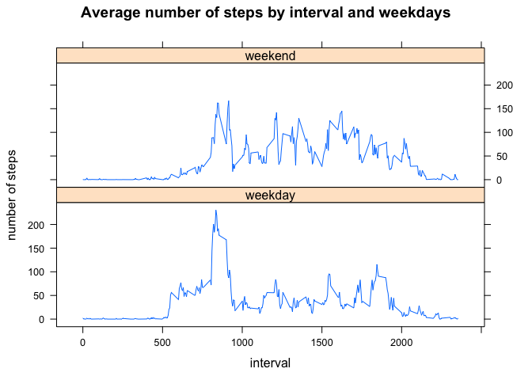

# Reproducible Research: Peer Assessment 1


## Loading and preprocessing the data

```r
activity <- read.csv("./activity.csv")
activity$date <- as.Date(activity$date)
```

## What is mean total number of steps taken per day?
 

The mean of the total number of steps taken per day

```
## [1] 9354.23
```

The median of the total number of steps taken per day

```
## [1] 10395
```

## What is the average daily activity pattern?
 

5-minute interval which contains the maximum number of steps

```
## [1] 835
```

## Imputing missing values
The total number of missing values in the dataset

```
## [1] 2304
```
The strategy for filling NAs --> use the mean for that 5-minute interval


Make a histogam again using imputed dataset
 

The mean of the total number of steps taken per day using imputed dataset

```
## [1] 10766.19
```

The median of the total number of steps taken per day using imputed dataset

```
## [1] 10766.19
```

These results are different from them which are calculated from the original dataset which contains missing data.

By imputing data, both mean and median of the total number of steps taken per interval increase.


## Are there differences in activity patterns between weekdays and weekends?
 
